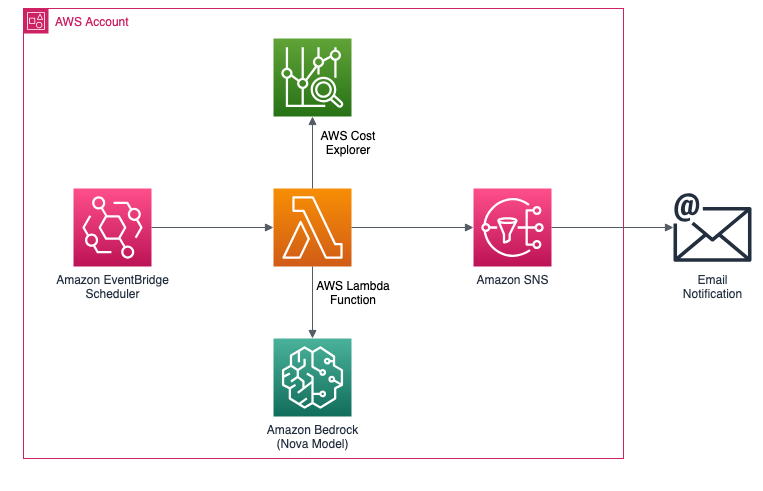
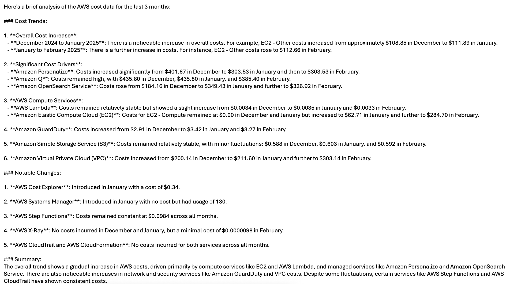

# AWS Billing Insights powered by Gen AI

## Overview

A comprehensive automated solution that analyzes AWS billing data across multiple months to provide actionable cost insights. The system processes historical invoice data, identifies spending patterns, and automatically generates detailed reports with key metrics and cost drivers. These insights are delivered directly to stakeholders via email, enabling informed decision-making for cloud cost optimization.

## Challenges

**Billing Complexity**
- Difficulty in identifying cost trends manually
- Time-consuming manual analysis of invoices

**Cost Visibility**
- Lack of clear insights into major cost drivers
- Limited understanding of month-over-month changes
- Difficulty tracking unexpected cost increases

**Stakeholder Communication**
- Delays in communicating cost changes to management
- Manual effort in preparing cost reports

## Solution
To address this challenge, billing insights can be implemented with the following features:

- Automated Scanning: Regularly scan previous invoices for the specified AWS account.

- Invoice Analysis and Enrichment: Analyse the previous invoives and leverage GenAI to generate insights from it.

- Notification System: Implement a notification system (e.g., using AWS SNS) to alert relevant teams or individuals about the billing insights.

By implementing this solution, organizations can track spends and idetify cost optimization opportunities which ultimately lead to reduced cloud costs, improved operational efficiency, and more strategic use of cloud resources.

## Architecture

  

## Workflow

- The Amazon Event Bridge Scheduler triggers the AWS Lambda function monthly (or as per schedule).
- The AWS Lambda function collects data from from cost explorer and analyze to get the insights using Amazon bedrock Nova model. Next, it uses SNS topic's subscription to send details over email.

## Prerequisites
Before deploying the solution, ensure that an existing SNS topic with subscription exists.

<b> Disclaimer: </b> This is sample code and users must conduct their own due diligence before deployment. It is strongly recommended to verify IAM permissions and follow the Pricinple of Least Privilege model.

https://docs.aws.amazon.com/IAM/latest/UserGuide/best-practices.html

## Deployment
Here are the steps to deploy the Solution using the provided CloudFormation template (billing-insights.yaml), along with a description of each parameter:

- Clone the repository Clone this repository to your local machine using the following command: `git clone https://github.com/aws-samples/sample-aws-billing-insights.git`

- Navigate to the repository directory `cd sample-aws-billing-insights`

- Create an AWS CloudFormation stack Open the AWS CloudFormation console and click on "Create stack" -> "With new resources (standard)"..

- Upload the CloudFormation template In the "Specify template" section, choose "Upload a template file" and select the `billing-insights.yaml` file from your local repository.

- Configure the parameters
In the "Specify stack details" section, provide the following parameters:

  - **Region** - Select the region category (us/apac/eu) required for selecting the model inference profile. For all US based AWS regions it should be us, for Asia–Pacific it should be apac and for Europe it shouled be eur.

  - **ScheduleExpr** - Enter the schedule for lambda, use rate expressions. The default value triggers this every 30 days. For more information https://docs.aws.amazon.com/AmazonCloudWatch/latest/events/ScheduledEvents.html#RateExpressions

  - **snsTopicArn** - SNS Topic Arn for sending notification for the billing insights

- Review and deploy Review the parameter values and click `Next` to review the stack details. Finally, check the "_I acknowledge that AWS CloudFormation might create IAM resources_" box and click `Create stack` to deploy the solution.

**Note**: If you want you solution to get the data for any value other than 3 months (default value), you can change the value in lambda function environment variable `Months` and prompt which is used for bedrock in `analysis_prompt` field.

## Benefits

<b>Financial Benefits:</b>
- Identify cost optimization opportunities and reduce unnecessary spending.
- Track spending trends and forecast future cloud costs accurately.
- Detect billing anomalies and unexpected cost spikes early.
- Optimize resource allocation based on usage patterns.

<b>Operational Improvements:<b/>
- Eliminate manual billing analysis, saving significant staff time.
- Receive proactive cost insights without human intervention.

<b>Strategic Advantages:</b>
- Better alignment of cloud spending with business objectives.
- Enhanced visibility into cloud ROI across projects.
- More effective resource planning and capacity management.
- Data-backed justification for cloud investments.

## Sample email notification

  

